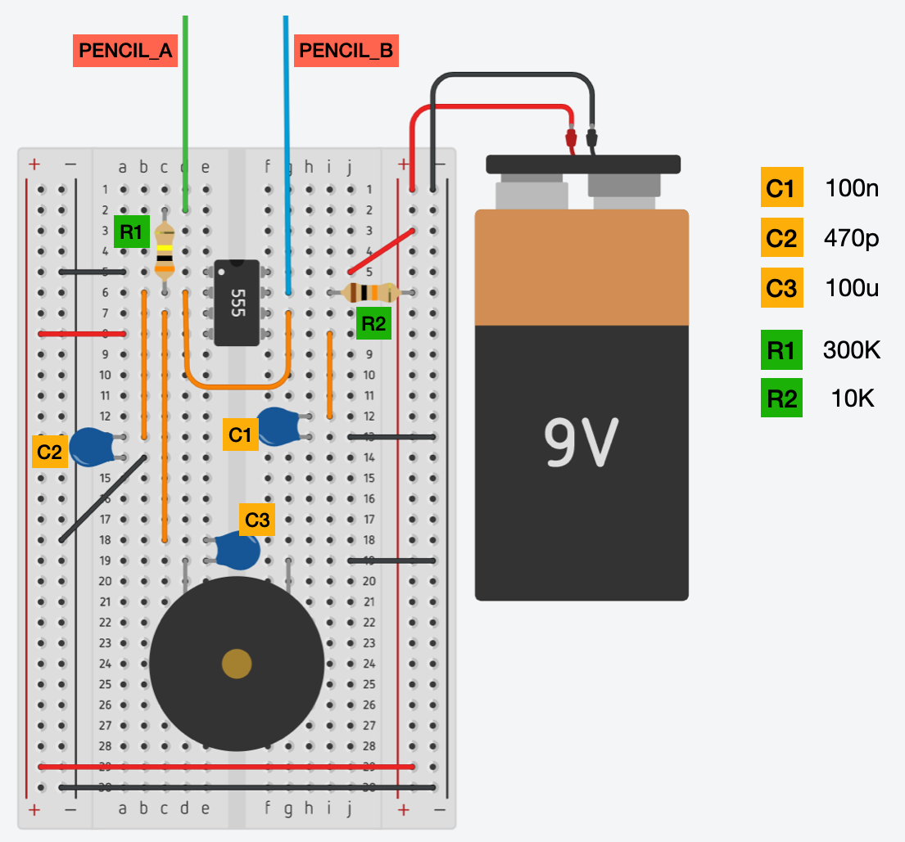
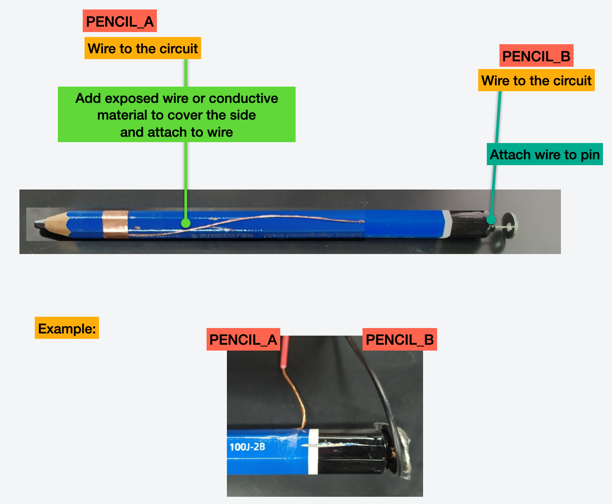
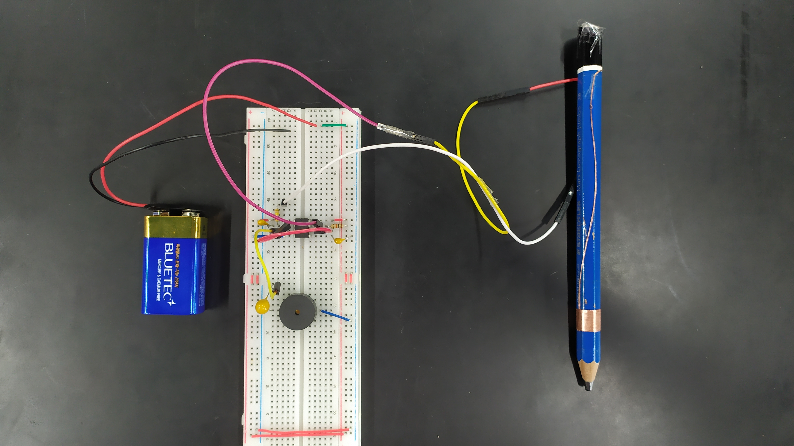
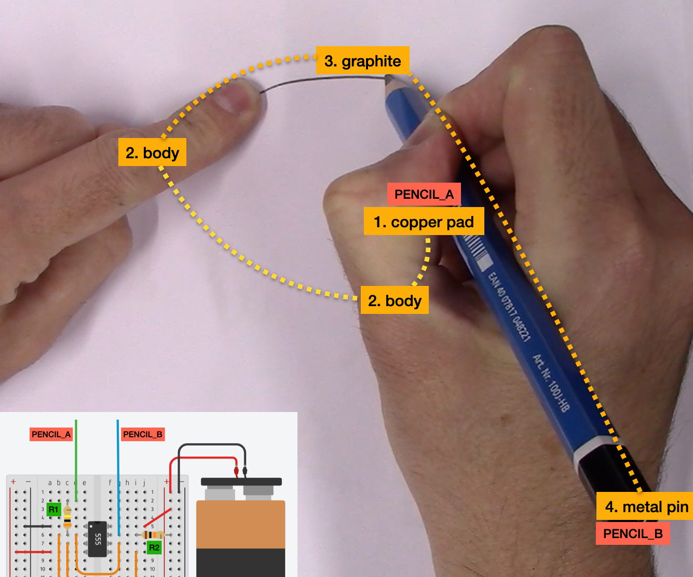
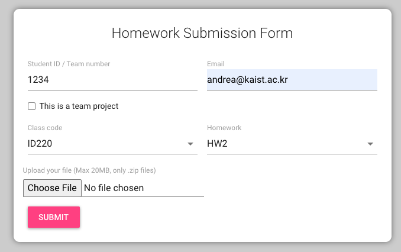

# Music-Pencil (Homework 2)

In this homework you will create a small musical instruments that **plays sounds by drawing** by placing and connecting components on a breadboard. You will also draw your first schematics using [EasyEDA](https://easyeda.com).

Click on the image below to see a demo video:

<a href="https://youtu.be/QYZcDkao8PM">

</a>

## Content of this folder

- [_SubmissionForm.md_](./SubmissionForm.md): the form containing the information about the video.
- _images_: a folder with some images for this document.
- _README_: this file, containing the instructions.

## Getting started

The homework consists of two parts.

### Part 1: Build the circuit

In the first part of the homework you will build the circuit in the figure below using a breadboard.

This circuit is connected to a pencil which is modified using a small metal pin on the back, and some conductive material placed where you grip the pencil, like in the figure below.

The entire project should look like something like in the figure below.

When you plug the battery and power up the circuit, while drawing you should start hearing a sound coming from the speaker. To achieve a nice sound, one hand should touch the graphite on the paper, while the other hand is holding the pencil. Just make sure that there is a path made of graphite between the hand and the tip of the pencil. As you can see in the figure below, your circuit exposed two wires (**PENCIL_A** and **PENCIL_B**). **PENCIL_A** terminates with a piece of copper pad or foil placed on the battery and in direct contact with the hand. **PENCIL_B** is a wire that is in contact with the graphite inside the pencil via a small metal pin.

When you draw like in the figure above, (1) the current flow from the copper pad to your hand (**PENCIL_A** point), through your body (2), and then through the graphite of the drawing, back inside of the pencil and then to the point **PENCIL_B**. The current is limited by the resistance of your body and of the graphite in the drawing. These changes of resistance, modify the pitch of the sound produced by the 555 timer chip.

#### Bill of Material (BOM)

Except capacitors, resistors, and battery all electronic components can be found in the [class kit](https://github.com/ID220/id220-parts-list).

- Breadboard
- 9V battery with connector
- Capacitor 100 nF
- Capacitor 470 pF
- Capacitor 100 uF
- Resistor 300 KΩ
- Resistor 10 KΩ
- NE555P (555 timer chip)
- Piezo speaker

Additional components for construction for you to buy:

- A pencil
- Wires and jumper wires
- Copper-tape or metal foil for food wrapping

### Part 2: Draw the schematics

Draw the schematics of the circuit presented in the image above (the circuit shown on the breadboard). To draw the schematics use [EasyEDA](https://easyeda.com). Export the schematics as a PDF file.

Here some tips:

1. If you need a quick tutorial of how to use EasyEDA, please watch [this tutorial](https://youtu.be/l33oX4VIUDU).

2. To draw the "component" between **PENCIL_A** and **PENCIL_B** you can either use a resistor and call it `user's body`, or you can actually draw a small image of a body with two connectors attached to it.

## Submission and grading

You have to submit the following items:

- Clear photos of your breadboard circuit
- A video demo of you drawing with the prototype (sound must be heard)
- PDF with schematics
- The form with your information: [_SubmissionForm.md_](./SubmissionForm.md)

Take clear photos of your breadboard, the [_SubmissionForm.md_](./SubmissionForm.md), and the PDF containing the schematics of the circuit, zip them together (_zip_, not _ALZIP_, _rar_ or others) and submit this resulting file using the [homework submission system](https://homework.prototyping.id). Make sure the zip file is smaller than 20MB.

**DO NOT SUBMIT THE VIDEO USING THE HOMEWORK SYSTEM**. Instead, upload the video online (YouTube, Google Drive...) and place a public link to the video inside the [_SubmissionForm.md_](./SubmissionForm.md) file.

Please note that:

1. Only submissions made with the system will be considered (no direct emails to TA or Prof).
2. You can re-submit as many times as you want before the deadline &ndash; we will consider your last submission.
3. Submissions after the deadline are **NOT** accepted.
4. If the file is too large the system won’t allow the submission. Remove from the zip file unnecessary files, and make sure to compress your images.
5. Do not copy from the Internet or colleagues without attribution. Remember the _honor code policy_.
